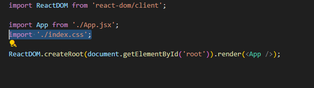
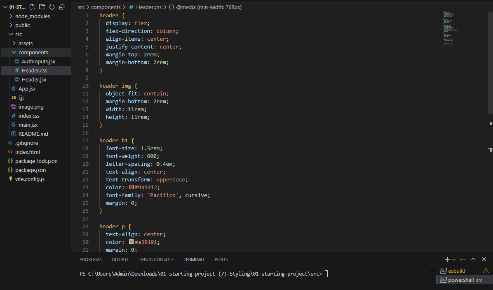
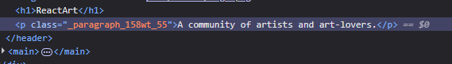
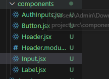
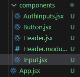

### file path> PS C:\Users\Admin\Downloads\01-starting-project (7)-Styling\01-starting-project> 
### Tailwind css is incomplete due to problem raised while installing it. 

<h1>105. Module Introduction & Starting Project</h1>

### This course is not sbout teaching CSS. 

### Here we will learn about-
## Styling with valilaCSS
## Scoping styles
## CSS-in-JS styling with "Styled Components"
## Styling with tail wind CSS
## Static & Dynamic (Conditional) Styling

<h1>106. Splitting CSS Code Across Multiple Files</h1>

### Unitl now we have worked with css this way. 
### We add all styles in the index.css and imported it in the main.jsx file. 


### This is how we split the scc file to the component specific. 


<h1>107. Styling React Apps with Vanilla CSS - Pros & Cons</h1>

## Advantages 
### CSS code is decoupled from the JSX code. 
### CSS code can be writeen by another developer who needs only a minimal access to your jSX code

## Disadvantages 
### You need to know CSS. 
### CSS code is not scoped to the component -> CSS rules may clash accross components. 

<h1>108. Vanilla CSS Styles Are NOT Scoped To Components!</h1>

## Even though we have imported the css in a particular component the styling are also applied to other componets which are un related. 

<h1>109. Styling React Apps with Inline Styles</h1>

### One solution for the above problem is to swith to inline styles. 

#### This is not how we should use the inline style prop in css. This will give raise to error. 
```jsx 
    <p style="color: red;">A community of artists and art-lovers.</p>
```

#### This is how we should set the styling. 
```jsx
<p style={{
        color: 'red',
        background: 'blue'
      }}>A community of artists and art-lovers.</p>
```

## Advantages 
### Quick and easy to add style to JSX
### Styles only effect the element to which we add them

## Disadvantages
### No seperation between CSS and JSX. 
### You need to style every element individually. 

<h1>110. Dynamic & Conditional Inline Styles</h1>

### This is how we add Dynamic & Conditional Inline Styles.

```jsx
 <input
            type="email"
            style={{
              backgroundColor : emailNotValid ? '#fed2d2' : '#d1d5db'
            }}
            //className={emailNotValid ? 'invalid' : undefined}
            onChange={(event) => handleInputChange('email', event.target.value)}
          />
```

<h1>111. Dynamic & Conditional Styling with CSS Files & CSS Classes</h1>

### Conditioning this way will give raise to an error. 

```jsx 
    className={emailNotValid && 'invalid'}
```
### This is the recommended way. 

```jsx 
 <input
            type="email"
            // This is the example for the conditional Styling with CSS files and CSS classes. 
            className={emailNotValid ? 'invalid' : undefined}
            onChange={(event) => handleInputChange('email', event.target.value)}
          />
```
### Adding a second class to a element. 

```jsx
    <label className={`label ${emailNotValid ? 'invalid' : ''}`}>Email</label>
```

<h1>112. Scoping CSS Rules with CSS Modules</h1>

### CSS Modules allows us to scope CSS Styles. CSS Modules is an approach. 

### Firstly, we have to change the perticular file nae to Header.module.css. Before this file was Header.css.

### Then we have to import it like 

```jsx 
    import classes from './Header.module.css'; 
```

### After that, we can use this css class-

```css
    .paragraph {
    text-align: center;
    color: #a39191;
    margin: 0;
    }
```

### In this jsx file this way-

```jsx 
import logo from '../assets/logo.png';
import classes from './Header.module.css'; // changes

export default function Header() {
  return (
    <header>
      
      <h1>ReactArt</h1>
      <p className={classes.paragraph}>A community of artists and art-lovers.</p> {/* changes  */}
    </header>
  );
}
```

### If we inspect that element in browsers developer tools it will look like this-



### Behind teh scenes the classes will be changes to to a unique class which is unique to that element which uses it. 

### Advantages of this approach 
#### CSS code is decoupled from the jsx file. 
#### CSS code can be written by another developer
####  CSS classes are scoped to the component.

### Disadvantages of this approach
#### We will end up with many relatively small CSS files in your project.

<h1>113. Introducing "Styled Components" (Third-party Package)</h1>

### The idea behind this package is that we do not create a seperate CSS file for styling. Instead we will crerate special css components. 

### First we have to install the modules using command "npm i styled-components",

### After that we have to import it in the component like-

```jsx 
import {styled} from 'styled-components';
```

### Now, lets imagine we want to style the div with controls name 

```jsx 
<div className="controls"> // Here
        <p>
          <label className={`label ${emailNotValid ? 'invalid' : ''}`}>Email</label>
          <input
            type="email"
            // This is the example for the conditional Styling with CSS files and CSS classes. 
            className={emailNotValid ? 'invalid' : undefined}
            onChange={(event) => handleInputChange('email', event.target.value)}
          />
        </p>
        <p>
          <label>Password</label>
          <input
            type="password"
            className={passwordNotValid ? 'invalid' : undefined}
            onChange={(event) =>
              handleInputChange('password', event.target.value)
            }
          />
        </p>
      </div>
```

### So, we should create a constant at the top level of the component file. like this

```jsx
    const ControlContainer = styled.div`
    display: flex;
    flex-direction: column;
    gap: 0.5rem;
    margin-bottom: 1.5rem;
    `
```

### After that we have simply use that const name as the element


```jsx
    <ControlContainer> 
            <p>
            <label className={`label ${emailNotValid ? 'invalid' : ''}`}>Email</label>
            <input
                type="email"
                // This is the example for the conditional Styling with CSS files and CSS classes. 
                className={emailNotValid ? 'invalid' : undefined}
                onChange={(event) => handleInputChange('email', event.target.value)}
            />
            </p>
            <p>
            <label>Password</label>
            <input
                type="password"
                className={passwordNotValid ? 'invalid' : undefined}
                onChange={(event) =>
                handleInputChange('password', event.target.value)
                }
            />
            </p>
    </ControlContainer>
```
<h1>114. Creating Flexible Components with Styled Components</h1>

### these new constants or elements we create using styled module will also pass down other class to the element. For example-

#### Here, Label is created using styled-component mnodule. 

```jsx 
    <Label className={`label ${emailNotValid ? 'invalid' : ''}`}>Password</Label>
```

### This is how the entire file looks like. 

```jsx
import { useState } from 'react';
import { styled } from 'styled-components';

const ControlContainer = styled.div`
  display: flex;
  flex-direction: column;
  gap: 0.5rem;
  margin-bottom: 1.5rem;
`;

const Label = styled.label`
  display: block;
  margin-bottom: 0.5rem;
  font-size: 0.75rem;
  font-weight: 700;
  letter-spacing: 0.1em;
  text-transform: uppercase;
  color: #6b7280;
`;

const Input = styled.input`
  width: 100%;
  padding: 0.75rem 1rem;
  line-height: 1.5;
  background-color: #d1d5db;
  color: #374151;
  border: 1px solid transparent;
  border-radius: 0.25rem;
  box-shadow: 0 1px 3px 0 rgba(0, 0, 0, 0.1), 0 1px 2px 0 rgba(0, 0, 0, 0.06);
`;

export default function AuthInputs() {
  const [enteredEmail, setEnteredEmail] = useState('');
  const [enteredPassword, setEnteredPassword] = useState('');
  const [submitted, setSubmitted] = useState(false);

  function handleInputChange(identifier, value) {
    if (identifier === 'email') {
      setEnteredEmail(value);
    } else {
      setEnteredPassword(value);
    }
  }

  function handleLogin() {
    setSubmitted(true);
  }

  const emailNotValid = submitted && !enteredEmail.includes('@');
  const passwordNotValid = submitted && enteredPassword.trim().length < 6;

  return (
    <div id="auth-inputs">
      <ControlContainer> 
        <p>
          <Label className={`label ${emailNotValid ? 'invalid' : ''}`}>Email</Label>
          <Input
            type="email"
            // This is the example for the conditional Styling with CSS files and CSS classes. 
            className={emailNotValid ? 'invalid' : undefined}
            onChange={(event) => handleInputChange('email', event.target.value)}
          />
        </p>
        <p>
          <Label className={`label ${emailNotValid ? 'invalid' : ''}`}>Password</Label>
          <Input
            type="password"
            className={passwordNotValid ? 'invalid' : undefined}
            onChange={(event) =>
              handleInputChange('password', event.target.value)
            }
          />
        </p>
      </ControlContainer>
      
      <div className="actions">
        <button type="button" className="text-button">
          Create a new account
        </button>
        <button className='button' onClick={handleLogin}>Sign In</button>
      </div>
    </div>
  );
}

```

<h1>115. Dynamic & Conditional Styling with Styled Components</h1>

### We can set styles dynimically this way-

```jsx 
    const Label = styled.label`
    display: block;
    margin-bottom: 0.5rem;
    font-size: 0.75rem;
    font-weight: 700;
    letter-spacing: 0.1em;
    text-transform: uppercase;
    color: ${(props)=> props.invalid ? '#f87171' : '#6b7280'};
    `;
```
# OR

```jsx 
    const Label = styled.label`
    display: block;
    margin-bottom: 0.5rem;
    font-size: 0.75rem;
    font-weight: 700;
    letter-spacing: 0.1em;
    text-transform: uppercase;
    color: ${({invalid})=> invalid ? '#f87171' : '#6b7280'};
    `;
```

### Sending argument to the label element- 
#### emailNotValid - is a validation check used to check if the email is valid or not. 

```jsx 
    <p>
        <Label invalid={emailNotValid}>Email</Label>
        <Input
        type="email"
        className={emailNotValid ? 'invalid' : undefined}
        onChange={(event) => handleInputChange('email', event.target.value)}
        />
    </p>
```

## It ius a naming convention that the props used forr the styled-components should have $ before like below-

```jsx
const Label = styled.label`
  display: block;
  margin-bottom: 0.5rem;
  font-size: 0.75rem;
  font-weight: 700;
  letter-spacing: 0.1em;
  text-transform: uppercase;
  color: ${(props)=> props.$invalid ? '#f87171' : '#6b7280'};
`;


const Input = styled.input`
  width: 100%;
  padding: 0.75rem 1rem;
  line-height: 1.5;
  background-color: ${(props)=> props.$invalid ?' #fed2d2': '#d1d5db'};
  color: ${(props)=> props.$invalid ? '#f87171' : '#6b7280'};
  border: 1px solid transparent;
  border-radius: 0.25rem;
  box-shadow: 0 1px 3px 0 rgba(0, 0, 0, 0.1), 0 1px 2px 0 rgba(0, 0, 0, 0.06);
`;
```

```jsx
    <p>
        <Label $invalid={emailNotValid}>Email</Label>
        <Input
        type="email"
        // This is the example for the conditional Styling with CSS files and CSS classes. 
        //className={emailNotValid ? 'invalid' : undefined}
        $invalid={emailNotValid}
        onChange={(event) => handleInputChange('email', event.target.value)}
        />
    </p>
```
# -------------------------------------------------------------------

## This is the entire file 

```jsx 
import { useState } from 'react';
import { styled } from 'styled-components';

const ControlContainer = styled.div`
  display: flex;
  flex-direction: column;
  gap: 0.5rem;
  margin-bottom: 1.5rem;
`;

// const Label = styled.label`
//   display: block;
//   margin-bottom: 0.5rem;
//   font-size: 0.75rem;
//   font-weight: 700;
//   letter-spacing: 0.1em;
//   text-transform: uppercase;
//   color: ${({invalid})=> invalid ? '#f87171' : '#6b7280'};
// `;

const Label = styled.label`
  display: block;
  margin-bottom: 0.5rem;
  font-size: 0.75rem;
  font-weight: 700;
  letter-spacing: 0.1em;
  text-transform: uppercase;
  color: ${(props)=> props.$invalid ? '#f87171' : '#6b7280'};
`;


const Input = styled.input`
  width: 100%;
  padding: 0.75rem 1rem;
  line-height: 1.5;
  background-color: ${(props)=> props.$invalid ?' #fed2d2': '#d1d5db'};
  color: ${(props)=> props.$invalid ? '#f87171' : '#6b7280'};
  border: 1px solid transparent;
  border-radius: 0.25rem;
  box-shadow: 0 1px 3px 0 rgba(0, 0, 0, 0.1), 0 1px 2px 0 rgba(0, 0, 0, 0.06);
`;

export default function AuthInputs() {
  const [enteredEmail, setEnteredEmail] = useState('');
  const [enteredPassword, setEnteredPassword] = useState('');
  const [submitted, setSubmitted] = useState(false);

  function handleInputChange(identifier, value) {
    if (identifier === 'email') {
      setEnteredEmail(value);
    } else {
      setEnteredPassword(value);
    }
  }

  function handleLogin() {
    setSubmitted(true);
  }

  const emailNotValid = submitted && !enteredEmail.includes('@');
  const passwordNotValid = submitted && enteredPassword.trim().length < 6;

  return (
    <div id="auth-inputs">
      <ControlContainer> 
        <p>
          <Label $invalid={emailNotValid}>Email</Label>
          <Input
            type="email"
            // This is the example for the conditional Styling with CSS files and CSS classes. 
            //className={emailNotValid ? 'invalid' : undefined}
            $invalid={emailNotValid}
            onChange={(event) => handleInputChange('email', event.target.value)}
          />
        </p>
        <p>
          <Label $invalid={passwordNotValid}>Password</Label>
          <Input
            type="password"
            $invalid={passwordNotValid}
            onChange={(event) =>
              handleInputChange('password', event.target.value)
            }
          />
        </p>
      </ControlContainer>
      
      <div className="actions">
        <button type="button" className="text-button">
          Create a new account
        </button>
        <button className='button' onClick={handleLogin}>Sign In</button>
      </div>
    </div>
  );
}

```

<h1>116. Styled Components: Pseudo Selectors, Nested Rules & Media Queries</h1>

# For media queries-

### we can selected all the component related css styling including the media query and add in the const that we created using the styled module. like this- But there is a catch

```jsx 
import logo from '../assets/logo.png';
// import classes from './Header.module.css'; // changes
import { styled } from 'styled-components';

const StyledHeader = styled.header`
  header {
  display: flex;
  flex-direction: column;
  align-items: center;
  justify-content: center;
  margin-top: 2rem;
  margin-bottom: 2rem;
}

header img {
  object-fit: contain;
  margin-bottom: 2rem;
  width: 11rem;
  height: 11rem;
}

header h1 {
  font-size: 1.5rem;
  font-weight: 600;
  letter-spacing: 0.4em;
  text-align: center;
  text-transform: uppercase;
  color: #9a3412;
  font-family: 'Pacifico', cursive;
  margin: 0;
}

.paragraph {
  text-align: center;
  color: #a39191;
  margin: 0;
}

@media (min-width: 768px) {
  header {
    margin-bottom: 4rem;
  }

  header h1 {
    font-size: 2.25rem;
  }
}
`;

export default function Header() {
  return (
    <StyledHeader>
      
      <h1>ReactArt</h1>
      <p>A community of artists and art-lovers.</p> {/* changes  */}
    </StyledHeader>
  );
}

```

# But Instead of the header we need to use '&' like this

```jsx 
import logo from '../assets/logo.png';
// import classes from './Header.module.css'; // changes
import { styled } from 'styled-components';

const StyledHeader = styled.header`
  display: flex;
  flex-direction: column;
  align-items: center;
  justify-content: center;
  margin-top: 2rem;
  margin-bottom: 2rem;

& img {
  object-fit: contain;
  margin-bottom: 2rem;
  width: 11rem;
  height: 11rem;
}

& h1 {
  font-size: 1.5rem;
  font-weight: 600;
  letter-spacing: 0.4em;
  text-align: center;
  text-transform: uppercase;
  color: #9a3412;
  font-family: 'Pacifico', cursive;
  margin: 0;
}

& p {
  text-align: center;
  color: #a39191;
  margin: 0;
}

@media (min-width: 768px) {

  margin-bottom: 4rem;
  
  & h1 {
    font-size: 2.25rem;
  }
}
`;

export default function Header() {
  return (
    <StyledHeader>
      
      <h1>ReactArt</h1>
      <p>A community of artists and art-lovers.</p> {/* changes  */}
    </StyledHeader>
  );
}
```
# For Pseudo selectors-

```jsx
    const Button = styled.button`
    padding: 1rem 2rem;
    font-weight: 600;
    text-transform: uppercase;
    border-radius: 0.25rem;
    color: #1f2937;
    background-color: #f0b322;
    border-radius: 6px;
    border: none;

    &:hover{
    background-color: #f0920e;
    }
    `;
```

<h1>117. Creating Reusable Components & Component Combinations</h1>

## In bigger project we might need to reuse the components. So, it is a good idea to make them reusable. 
### We will create jsx files for each of these elements like buttons and labels. 

#### Like this-


# Overview of entire component strructure.
## File tree


# AuthInput.jsx
### The props name do not require to have $before the name.
```jsx
import { useState } from 'react';
import { styled } from 'styled-components';
import Button from './Button.jsx';
import Input from './Input.jsx';

const ControlContainer = styled.div`
  display: flex;
  flex-direction: column;
  gap: 0.5rem;
  margin-bottom: 1.5rem;
`;

export default function AuthInputs() {
  const [enteredEmail, setEnteredEmail] = useState('');
  const [enteredPassword, setEnteredPassword] = useState('');
  const [submitted, setSubmitted] = useState(false);

  function handleInputChange(identifier, value) {
    if (identifier === 'email') {
      setEnteredEmail(value);
    } else {
      setEnteredPassword(value);
    }
  }

  function handleLogin() {
    setSubmitted(true);
  }

  const emailNotValid = submitted && !enteredEmail.includes('@');
  const passwordNotValid = submitted && enteredPassword.trim().length < 6;

  return (
    <div id="auth-inputs">
      <ControlContainer>
        <Input
          label='Email'
          type="email"
          // This is the example for the conditional Styling with CSS files and CSS classes. 
          //className={emailNotValid ? 'invalid' : undefined}
          invalid={emailNotValid}
          onChange={(event) => handleInputChange('email', event.target.value)}
        />
        <Input
          label='Password'
          type="password"
          invalid={passwordNotValid}
          onChange={(event) =>
            handleInputChange('password', event.target.value)
          }
        />
      </ControlContainer>

      <div className="actions">
        <button type="button" className="text-button">
          Create a new account
        </button>
        <Button onClick={handleLogin}>Sign In</Button>
      </div>
    </div>
  );
}

```

## Input.jsx
### Label are Inputs are mostly used with each other so the idea here is to merrge them.
### onChange event will be passed to the underlying input due to how the props are set using spread.
```jsx 
import { styled } from 'styled-components';

const Label = styled.label`
  display: block;
  margin-bottom: 0.5rem;
  font-size: 0.75rem;
  font-weight: 700;
  letter-spacing: 0.1em;
  text-transform: uppercase;
  color: ${({$invalid}) => $invalid ? '#f87171' : '#6b7280'};
`;

const Input = styled.input`
  width: 100%;
  padding: 0.75rem 1rem;
  line-height: 1.5;
  background-color: ${(props) => props.$invalid ? ' #fed2d2' : '#d1d5db'};
  color: ${(props) => props.$invalid ? '#f87171' : '#6b7280'};
  border: 1px solid transparent;
  border-radius: 0.25rem;
  box-shadow: 0 1px 3px 0 rgba(0, 0, 0, 0.1), 0 1px 2px 0 rgba(0, 0, 0, 0.06);
`;

export default function CustomInput({label, invalid, ...props}) {
    return <p>
        <Label $invalid={invalid}> {label} </Label>
        <Input $invalid={invalid} {...props} />
    </p>
}
```

# Button.jsx
```jsx
import { styled } from 'styled-components';

const Button = styled.button`
  padding: 1rem 2rem;
  font-weight: 600;
  text-transform: uppercase;
  border-radius: 0.25rem;
  color: #1f2937;
  background-color: #f0b322;
  border-radius: 6px;
  border: none;

  &:hover{
   background-color: #f0920e;
  }
`;

export default Button;
```
## Advantages 
### Quick and easy to add. 
### Styles are scoped to components. 
### We will continue thinking in React. 

## Disadvantages 
### No clear seperration of React and CSS. 
### We will endup with lot of relatively small 'wrapper' components. 

<h1>118. Introducing Tailwind CSS For React App Styling</h1>

### Tail wind css can be usedd in any web application. 

<h1>119. Tailwind 3 vs 4</h1>

<h1>120. Adding & Using Tailwind CSS In A React Project</h1>

<h1>121. Tailwind: Media Queries & Pseudo Selectors</h1>

<h1>122. Dynamic & Conditional Styling with Tailwind</h1>

<h1>123. Migrating The Demo App to Tailwind CSS</h1>

<h1>124. Tailwind CSS: Pros & Cons</h1>

### Go to https://tailwindcss.com/docs/installation/tailwind-cli.
### Then 